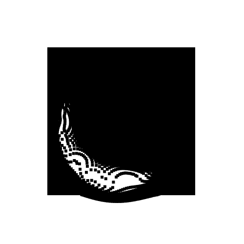

An animation toy for [my Tumblr](http://jordanorelli.tumblr.com/), which is mostly animated gifs made with [Processing](http://processing.org/).

This particular sketch involves the creation of a particle system.  Each
particle system calculates a repelling force from one or more registered
repellants.  For the sake of making something that would loop nicely, I created
a repellant that moves in a fixed circle, but a mouse repellant is also
implemented (i.e., particles will avoid your mouse).  I got a bit bored of
doing it towards the end so it's not perfectly cleaned up but it illustrates
some basics about how to work with particle systems and how to calculate forces
between particles.  This is also the first time I've spent some time messing
with the [controlp5](http://www.sojamo.de/libraries/controlP5/) library, which
I'll probably use a little bit in all of my Processing projects moving forward.

Anyway, the output of running the code can be exported to a series of images
and compressed into an animated gif that looks like this:
.
